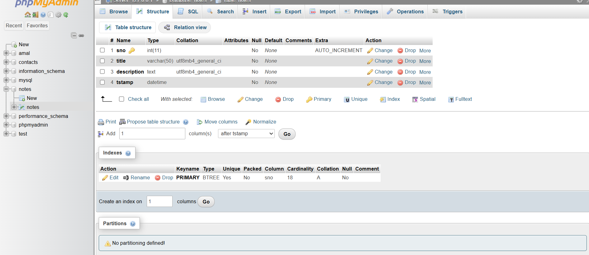

# My-Notes - Notes Taking Made Easy

Welcome to **My-Notes**, a simple note-taking web application built using PHP and MySQL. This application allows you to add, edit, and delete notes easily. Below is a detailed guide to help you understand how this application works and how you can use it.

## Features

- **Add Notes**: You can add new notes with a title and description.
- **Edit Notes**: You can edit existing notes to update their title or description.
- **Delete Notes**: You can delete notes that you no longer need.
  
## SQL Database

The application uses a MySQL database to store the notes. The database schema is as follows:

```sql
CREATE TABLE notes (
    sno INT(11) NOT NULL AUTO_INCREMENT,
    title VARCHAR(50) NOT NULL,
    description TEXT NOT NULL,
    tstamp DATETIME NOT NULL DEFAULT CURRENT_TIMESTAMP,
    PRIMARY KEY (sno)
);
```
;


## How It Works

### Adding a Note

1. Open the application in your web browser.
2. You will see a form with fields for "Note Title" and "Note Description".
3. Fill in the title and description of your note.
4. Click the "Add Note" button to save your note.

### Editing a Note

1. In the list of notes, find the note you want to edit.
2. Click the "Edit" button next to the note.
3. A modal (popup) will appear with the current title and description of the note.
4. Update the title and description as needed.
5. Click the "Save changes" button to update the note.

### Deleting a Note

1. In the list of notes, find the note you want to delete.
2. Click the "Delete" button next to the note.
3. A confirmation dialog will appear asking if you are sure you want to delete the note.
4. Click "OK" to delete the note.

## Technical Details

### Database Connection

The application connects to a MySQL database named `notes` using the following credentials:

- **Server**: localhost
- **Username**: root
- **Password**: (empty)

### PHP Script

The main PHP script (`index.php`) handles the following tasks:

- **Connecting to the database**: Establishes a connection to the MySQL database.
- **Handling form submissions**: Processes form submissions to add or update notes.
- **Deleting notes**: Deletes notes based on the note ID passed in the URL.

### HTML and Bootstrap

The user interface is built using HTML and styled with Bootstrap for a responsive and modern look. The application also uses DataTables for displaying the list of notes in a table format.

### JavaScript

JavaScript is used to handle the following interactions:

- **Edit button**: Opens the edit modal with the current note details.
- **Delete button**: Confirms and deletes the selected note.

## Conclusion

iNotes is a simple yet powerful note-taking application that helps you keep track of your notes efficiently. Whether you need to jot down quick reminders or detailed information, iNotes makes it easy to manage your notes.

Happy note-taking!
